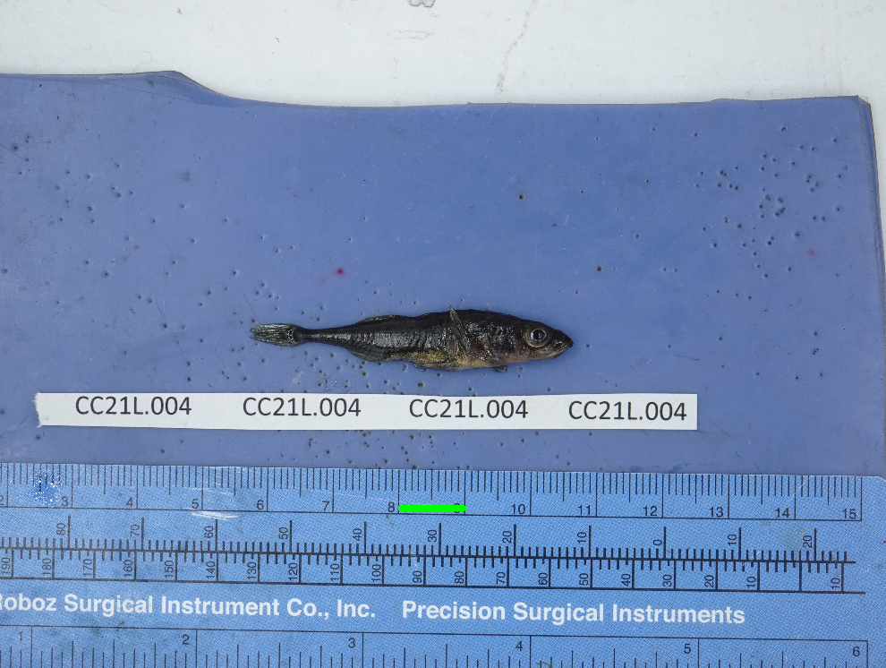
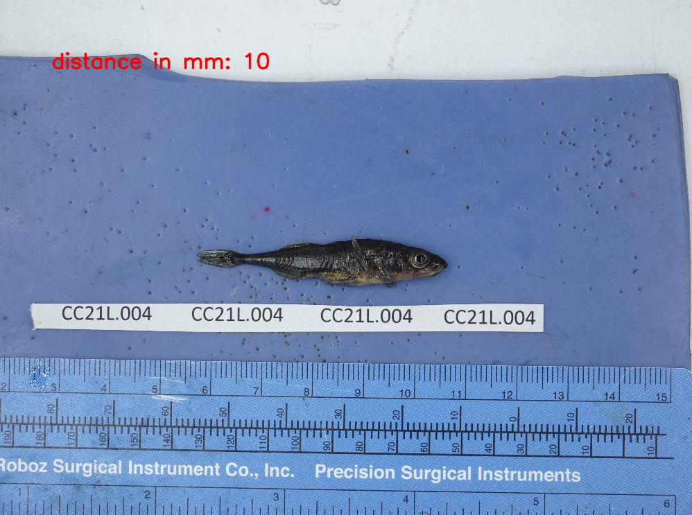
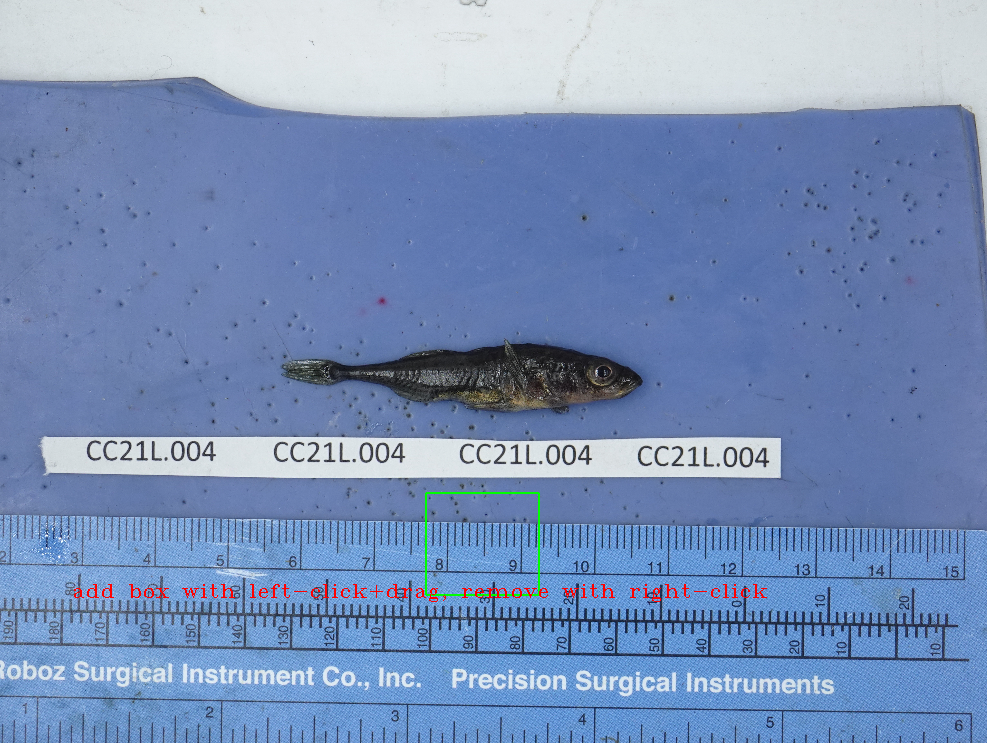

<h3 align="center">StickleSnake</h3>

  <p align="center">
    A phenotyping pipeline for threespine stickelback based around the SnakeMake workflow manager
    <br />
    <a href="https://github.com/sulserrb/StickleSnake"><strong>Explore the docs »</strong></a>
    <br />
    <br />
    <a href="https://github.com/sulserrb/StickleSnake/issues/new?labels=bug&template=bug-report---.md">Report Bug</a>
    &middot;
    <a href="https://github.com/sulserrb/StickleSnake/issues/new?labels=enhancement&template=feature-request---.md">Request Feature</a>
  </p>
</div>

<!-- TABLE OF CONTENTS -->
<details>
  <summary>Table of Contents</summary>
  <ol>
    <li>
      <a href="#about-the-project">About The Project</a>
      <ul>
    </li>
    <li>
      <a href="#getting-started">Getting Started</a>
      <ul>
        <li><a href="#prerequisites">Prerequisites</a></li>
        <li><a href="#installation">Installation</a></li>
      </ul>
            <a href="#usage">Usage</a>
      <ul>
        <li><a href="#setting-a-template">Setting a Template</a></li>
        <li><a href="#main-program">Main Program</a></li>
      </ul>
    </li>
    <li><a href="#usage">Usage</a></li>
    <li><a href="#contributing">Contributing</a></li>
    <li><a href="#license">License</a></li>
    <li><a href="#contact">Contact</a></li>
  </ol>
</details>


<!-- ABOUT THE PROJECT -->
## About The Project

This repo contains all necessary files for SnakeMake, a 2D phenotyping pipeline for automatic measurement and analysis of threespine stickleback specimens. Also included are sample data and templates needed to run through the tutorial, which also recreates the key findings and steps in the main publication. 


<p align="right">(<a href="#readme-top">back to top</a>)</p>


<!-- GETTING STARTED -->
## Getting Started

This is an example of how you may give instructions on setting up your project locally.
To get a local copy up and running follow these simple example steps.

### Prerequisites

There are a few important dependencies to download before starting. Most essential is SnakeMake itself: https://snakemake.github.io/
There are a few different options for this, depending on your preferences (see the installation page of SnakeMake itself for more details).


* Snakemake (conda)
```sh
  conda create -c conda-forge -c bioconda -c nodefaults -n snakemake snakemake
  conda activate snakemake
```

* Snakemake (pip)
```sh
  pip install snakemake
```
* Snakemake (pixi)

```sh
  pixi init
  pixi workspace channel add conda-forge
  pixi workspace channel add bioconda
  pixi add snakemake
```

If you want to create your own templates (highly recommended), you will also need to install phenopype: https://www.phenopype.org/
See the installation page of phenopype for more details. It is important that this program is installed on a machine that allows for interactive (GUI) input.
The bulk of the pipeline can be run headless and/or on a cluster, and the files can be simply transferred to these machines

* phenopype (pip)
```sh
  pip install phenopype
```

Finally, on the machine you intend to use this program, install the container. This can be done with whatever program you prefer/is installed on your cluster: 

* docker
```sh
   docker pull thoschiller/research_project
```

* apptainer
```sh
   apptainer pull thoschiller/research_project
```
* singularity
```sh
   singularity pull thoschiller/research_project
```


### Installation

1. Clone the repo. This will install all files assocaited with the program and tutorial. 
   ```sh
   git clone https://github.com/sulserrb/StickleSnake.git
   ```

2. Change git remote url to avoid accidental pushes to base project
   ```sh
   git remote set-url origin sulserrb/StickleSnake
   git remote -v # confirm the changes
   ```


<p align="right">(<a href="#readme-top">back to top</a>)</p>

<!-- USAGE EXAMPLES -->
## Usage

This program can automatically relabel files in images, set a scale, and landmark specimen images. While it can work with small datasets, the program is designed for large-scale projects and sampling for use by the larger stickleback community. 

### Setting a template

While we have provided a test template for running a tutorial, users will almost certainly want to provide their own templates for matching. This can be done with the following command from the root directory: 

```sh
python initialize_templates_light.py --template_name <name for template> --ref_image_path <path/to/imaage>
```

A window will then pop up. Measure two points on a ruler or known reference object with the left click, remove with the right click. Press /<ENTER>/ to confirm when ready. 



A second window with an input will pop up - enter the length (in mm) of the distance you just measured. Press /<ENTER>/ to confirm. 



A final window will pop up.  Draw the template itself using left click + drag, ensuring that this encompasses the initial measurement line. 



_For examples and use cases, please refer to the main paper (https://placeholder.url.com)_

## Main Program 

The StickleSnake pipeline is broken into two main components, to better divide the common tasks of image preprocessing (steps 1-3; label reading, cropping, and measuring) and landmarking (steps 4-5; model training and landmark application) as described in the publication. The orignal default (default: workflow/profiles/default/config.yaml) uses apptainer; change this path to the docker or singularity if you prefer. 

### Preprocessing step 

Check the config file (default: resources/configs/StickleSnake.yaml) and the user profile (default: workflow/profiles/default/config.yaml)  to ensure settings and filepaths are set correctly prior to use. This will run all necessary steps up to the landmark training and prediction

```bash
snakemake -snakefile workflow/preprocessing.smk --profile workflow/profiles/default 
```

### Landmarking

Check the config file (default: resources/configs/model_params.yaml) and the user profile (default: workflow/profiles/default/config.yaml) to ensure settings and filepaths are set correctly prior to use. This will run all steps from landmark training to landmark analysis.

```bash
snakemake --snakefile workflow/landmarking.smk --profile workflow/profiles/default 
```

### All unfinished steps

All steps can be run with the following command (helpful for validating install/following this tutorial). Snakemake will run any steps not yet finished, helpful for validating an finished run and checking if files have changed or been updated. 

```sh
snakemake --snakefile workflow/Snakefile --profile workflow/profiles/default 
```


<p align="right">(<a href="#readme-top">back to top</a>)</p>


<!-- CONTRIBUTING -->
## Contributing

 Any contributions you make are **greatly appreciated**. If you have a suggestion that would make this better, please fork the repo and create a pull request. You can also simply open an issue with the tag "enhancement".

1. Fork the Project
2. Create your Feature Branch (`git checkout -b feature/AmazingFeature`)
3. Commit your Changes (`git commit -m 'Add some AmazingFeature'`)
4. Push to the Branch (`git push origin feature/AmazingFeature`)
5. Open a Pull Request

<p align="right">(<a href="#readme-top">back to top</a>)</p>


<!-- LICENSE -->
## License

To be built alongside publication and release. 

<p align="right">(<a href="#readme-top">back to top</a>)</p>

<!-- CONTACT -->
## Contact

Ben Sulser - r.benjamin.sulser@unibe.ch

Project Link: [https://github.com/sulserrb/StickleSnake](https://github.com/sulserrb/StickleSnake)

<p align="right">(<a href="#readme-top">back to top</a>)</p>
